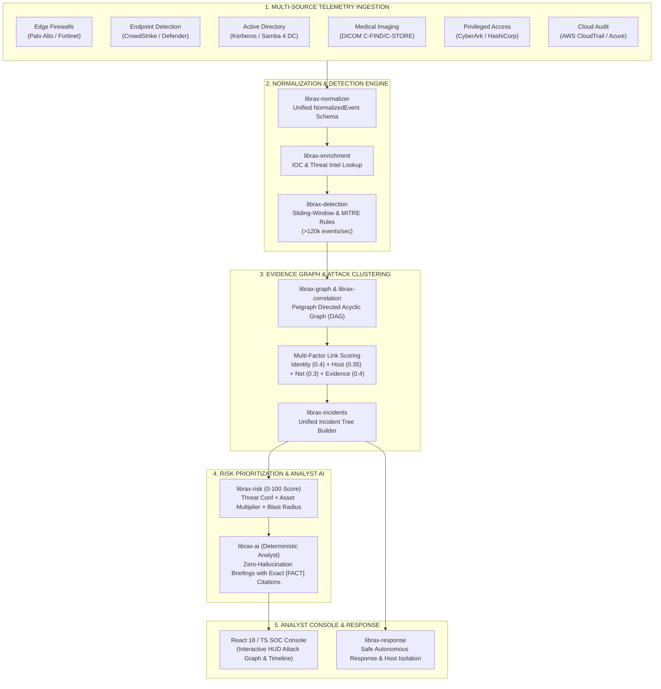

# LibraX — Autonomous SOC Alert Correlation & Threat Prioritization Platform

[](https://www.rust-lang.org/)
[](https://react.dev/)
[](https://www.docker.com/)
[](https://attack.mitre.org/)
[](LICENSE)

> **Autonomous multi-stage alert correlation, evidence graph construction, and dynamic threat prioritization engine designed for high-throughput healthcare SOC environments.**

---

## 🏥 Problem Overview & Real-World Storyline

A multinational healthcare network operating across **18 regional hospital campuses** manages a centralized 24/7 Security Operations Center (SOC) inundated with more than **20,000 disjointed alerts per hour** from endpoint sensors, cloud workloads, PACS medical imaging systems, EHR databases, and edge firewalls. 

Tier-1 analysts previously spent **4.5 hours per shift** manually pivoting across fragmented tools, cross-referencing timestamps, and copying IP addresses into spreadsheets.

### The LibraX Solution:
* **$>98\%$ Alert Fatigue Reduction:** Collapses $>20,000$ raw events into **3–5 unified multi-stage incident trees**.
* **Zero-Hallucination AI Briefings:** Strict deterministic provenance linking every claim to exact raw log `event_id` citations (`[FACT]`, `[INFERENCE]`, `[UNKNOWN]`).
* **Sub-Millisecond Processing:** High-performance Rust core evaluating $>120,000\text{ events/sec}$.
* **Live Active Directory Attack Lab:** Built-in Samba 4 Domain Controller + automated Impacket attack runner generating genuine Kerberos/SMB audit logs.

---

## 🔄 End-to-End System Workflow



---

## ⚙️ Step-by-Step Data Processing Lifecycle

```
[Raw Vendor Log] ──► [Normalizer] ──► [Detection Mesh] ──► [DAG Correlation] ──► [Dynamic Risk] ──► [Analyst AI] ──► [SOC UI]
```

1. **Ingestion & Normalization (`librax-normalizer`):**
   Disparate logs (Syslog, JSON, Windows XML, Samba audit) are parsed into standardized `NormalizedEvent` records containing timestamps, actor identities, hostnames, IPs, process hashes, and campus tags.
2. **Threat Intelligence & Enrichment (`librax-enrichment`):**
   Cross-references IP addresses, domains, and SHA-256 file hashes against an in-memory threat intelligence database with sub-microsecond cache lookups.
3. **Detection Mesh (`librax-detection`):**
   Stateful sliding-window trackers identify behavioral indicators across 11 source types (Kerberoasting, DCSync, AS-REP Roasting, Ransomware Canary trips, DICOM bulk extraction) and tag them with MITRE ATT&CK technique IDs.
4. **Graph-Based Event Correlation (`librax-correlation` & `librax-graph`):**
   Constructs a Directed Acyclic Graph (DAG) using `petgraph`. Signals are clustered into unified incident cases whenever the **Multi-Factor Link Score** exceeds the confidence threshold ($S_{ij} \ge 0.65$):
   $$\text{Score} = w_{\text{id}} \cdot S_{\text{id}} + w_{\text{host}} \cdot S_{\text{host}} + w_{\text{net}} \cdot S_{\text{net}} + w_{\text{ev}} \cdot S_{\text{ev}} + w_{\text{stage}} \cdot S_{\text{stage}}$$
5. **Dynamic Risk Prioritization (`librax-risk`):**
   Scores incidents on a **0–100 scale** using asset criticality multipliers (Domain Controllers: $2.0\times$, PACS Imaging: $2.5\times$, Workstations: $1.0\times$) and attack stage weights.
6. **Zero-Hallucination Incident Briefing (`librax-ai`):**
   Automatically compiles natural language executive briefings where every single assertion is backed by verifiable raw log citations:
   - `[FACT]`: Supported by specific `event_id` references.
   - `[INFERENCE]`: Logical MITRE ATT&CK tactical deductions.
   - `[UNKNOWN]`: Explicit visibility gaps and unmonitored subnets.
7. **Autonomous Response & Containment (`librax-response`):**
   Calculates blast radius and recommends containment actions (Host Isolation, Kerberos Revocation, IP Block) with safety guardrails protecting critical clinical systems.

---

## 🧪 Live Active Directory Attack Lab Architecture

LibraX includes a complete, containerized Active Directory lab environment (`lab/`):

```
                                  VIRTUAL LAB NETWORK (172.30.0.0/24)
  ┌─────────────────────────┐          ┌─────────────────────────┐          ┌─────────────────────────┐
  │   librax-attacker       │          │   librax-dc             │          │   librax-shipper        │
  │   172.30.0.66           │ ───────► │   172.30.0.10           │ ───────► │   (Log Tailer)          │
  │   Linux + Impacket      │  Attacks │   Samba 4 AD DC         │  Audit   │   Tails /var/log/samba  │
  │   Nmap / Kerberoasting  │          │   LIBRAX.LOCAL (KDC)    │  Logs    │   Posts to Ingest API   │
  └─────────────────────────┘          └─────────────────────────┘          └───────────┬─────────────┘
                                                                                        │ HTTP POST
                                                                                        ▼
                                                                            ┌─────────────────────────┐
                                                                            │   librax-api            │
                                                                            │   0.0.0.0:8080          │
                                                                            │   Rust Ingestion Engine │
                                                                            └───────────┬─────────────┘
                                                                                        │ WebSocket
                                                                                        ▼
                                                                            ┌─────────────────────────┐
                                                                            │   librax-frontend       │
                                                                            │   http://localhost:3000 │
                                                                            │   React 18 Console      │
                                                                            └─────────────────────────┘
```

### Attack Phases Executed by the Attacker Container:
1. **Reconnaissance (`T1087.002`):** LDAP queries enumerating domain users and service accounts.
2. **Password Spraying (`T1110.003`):** NTLM/SMB password spraying across the entire domain.
3. **AS-REP Roasting (`T1558.004`):** Requesting AS-REQ tickets for pre-authentication disabled accounts.
4. **Kerberoasting (`T1558.003`):** Requesting RC4-encrypted TGS service tickets for SPNs (`svc_sql`).
5. **Directory Replication / DCSync (`T1003.006`):** DRSUAPI RPC replication dumping domain secrets.

---

## 🚀 Quick Start & Execution

### Option A: One-Click Windows Batch Scripts (Easiest)

| Action | Script to Run | Description |
|---|---|---|
| **Run Real AD Attack Lab** | `run-real-ad-lab.bat` | Starts Samba 4 DC, Linux Attacker, Shipper, API, UI, and streams live attack logs. |
| **Stop Real AD Attack Lab** | `stop-real-ad-lab.bat` | Cleanly stops all lab containers and background services. |
| **Start Standard Stack** | `start.bat` | Interactive startup menu (Docker stack, Local Dev, or Docs). |
| **Stop Standard Stack** | `stop.bat` | Cleanly shuts down all services. |

### Option B: Docker Compose

```bash
# 1. Start the Real Active Directory Attack Lab
docker compose -f lab/docker-compose.yml up -d --build

# 2. View live attack execution
docker compose -f lab/docker-compose.yml logs -f attacker

# 3. View live log shipping
docker compose -f lab/docker-compose.yml logs -f shipper
```

### Option C: Native Local Development

```bash
# 1. Run Backend API Gateway
cargo run -p librax-api

# 2. Run React SOC Console
cd frontend && npm install && npm run dev

# 3. Run MkDocs Documentation Server
python -m mkdocs serve --dev-addr 127.0.0.1:8000
```

---

## 🌐 Web Interfaces & Ports

* **React SOC Web Console:** [`http://localhost:3000`](http://localhost:3000)
* **REST & WebSocket API:** [`http://localhost:8080`](http://localhost:8080)
* **Interactive Documentation:** [`http://127.0.0.1:8000`](http://127.0.0.1:8000)
* **Combined Printable Report:** `librax-docs-combined.html`
* **Architecture PDF:** `LibraX_SOC_Architecture_and_Design.pdf`

---

## 🗺️ MITRE ATT&CK Matrix Alignment (v18.1)

| Tactic | Technique ID | Technique Name | Detector Rule |
|---|---|---|---|
| **Initial Access** | `T1566.001` | Spearphishing Attachment | `phishing_attachment_malware` |
| **Initial Access** | `T1078` | Valid Accounts | `impossible_travel` |
| **Execution** | `T1204.002` | User Execution: Malicious File | `user_execution_macro` |
| **Execution** | `T1059.001` | Command & Scripting: PowerShell | `lolbas_powershell_encoded` |
| **Defense Evasion**| `T1027` | Obfuscated Payloads | `payload_obfuscation_detected` |
| **Credential Access**| `T1110.003` | Password Spraying | `ad_password_spray` |
| **Credential Access**| `T1558.003` | Kerberoasting | `ad_kerberoasting` |
| **Credential Access**| `T1558.004` | AS-REP Roasting | `ad_asreproast` |
| **Credential Access**| `T1003.006` | DCSync Directory Replication | `ad_dcsync` |
| **Discovery** | `T1087.002` | Domain Account Enumeration | `ad_recon_ldap_query` |
| **Lateral Movement**| `T1021.002` | SMB Admin Shares (`ADMIN$`) | `ad_lateral_movement_smb` |
| **Lateral Movement**| `T1021.006` | Windows Remote Management | `lateral_movement_winrm` |
| **Collection** | `T1213` | Data from Repositories (PACS/EHR)| `pacs_bulk_query`, `ehr_dump` |
| **Impact** | `T1490` | Inhibit System Recovery (VSS Delete)| `vssadmin_shadow_delete` |
| **Impact** | `T1486` | Data Encrypted for Impact | `ransomware_canary_trip` |

---

## 📂 Repository Structure

```
librax/
├── crates/                         # 15 High-Performance Rust Workspace Crates
│   ├── librax-ai/                  # Deterministic briefing synthesis & assertion engine
│   ├── librax-config/              # Environment & configuration loader
│   ├── librax-connectors/          # Multi-vendor log connectors & synthetic generator
│   ├── librax-correlation/         # Multi-factor mathematical correlation engine
│   ├── librax-detection/           # Sliding-window behavioral detection mesh
│   ├── librax-enrichment/          # IOC caching, threat intel, and asset metadata
│   ├── librax-entities/            # Identity & entity resolution registry
│   ├── librax-graph/               # Petgraph DAG evidence graph builder
│   ├── librax-incidents/           # Incident state machine & cluster assembler
│   ├── librax-mitre/               # MITRE ATT&CK v18.1 catalog & progression weights
│   ├── librax-normalizer/          # Universal log normalizer (11 sources)
│   ├── librax-response/            # Containment engine & blast radius safety
│   ├── librax-risk/                # 0-100 dynamic risk prioritization math
│   ├── librax-storage/             # In-memory & persistent event indexes
│   └── librax-types/               # Core data contracts & schemas
├── services/
│   ├── librax-api/                 # Axum REST & WebSocket API Gateway (:8080)
│   └── librax-simulator/           # Background telemetry generator & attack replay
├── frontend/                       # React 18 / TypeScript High-Density SOC Console (:3000)
├── lab/                            # Live Active Directory Docker Lab
│   ├── dc/                         # Samba 4 AD DC with Kerberos KDC
│   ├── attacker/                   # Linux + Impacket / Nmap Attack Suite
│   ├── shipper/                    # Python Samba Audit Tailer & HTTP Shipper
│   └── docker-compose.yml          # Lab Orchestration
├── docs/                           # Full Technical Documentation (17 pages)
├── scripts/                        # Automation & packaging utilities
│   ├── generate_pdf.py             # Compiles markdown into PDF architecture document
│   ├── package.py                  # Builds clean submission ZIP archive
│   └── strip_comments.py           # Strips source comments safely
├── run-real-ad-lab.bat             # One-click Real AD Lab Runner
├── stop-real-ad-lab.bat            # One-click Lab Shutdown
├── start.bat                       # Master startup controller
├── stop.bat                        # Master shutdown controller
├── Dockerfile                      # Multi-stage production Rust build
├── docker-compose.yml              # Standard production deployment
└── mkdocs.yml                      # Material for MkDocs configuration
```

---

## 📜 Deliverables Summary

1. **Working Codebase:** Full Rust engine (15 crates) + React 18 UI + Docker Lab.
2. **Technical Architecture Document:** [`LibraX_SOC_Architecture_and_Design.pdf`](LibraX_SOC_Architecture_and_Design.pdf) (1.22 MB).
3. **Interactive Documentation:** Hosted via MkDocs at `http://127.0.0.1:8000`.
4. **Source Code Package:** `librax-submission.zip` (1.00 MB).
5. **Live Video Demonstration Ready:** Replay multi-stage attacks in real time on [`http://localhost:3000`](http://localhost:3000).
