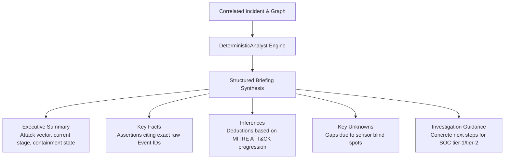

# Analyst AI & Briefing Synthesis (`librax-ai`)

The `librax-ai` crate generates automated, human-readable analyst briefings for security incidents. Unlike standard LLM implementations that can hallucinate details, LibraX enforces a **deterministic citation engine** where every generated claim must be provably backed by raw telemetry evidence.

---

## Briefing Architecture & Statement Schema



### Statement Data Model (`Statement`)

```rust
pub struct Statement {
    pub text: String,                      // Narrative sentence
    pub assertion: Assertion,              // Fact, Inference, Unknown
    pub citations: Vec<String>,            // Cited Event IDs proving this statement
    pub confidence: f32,                   // 0.0 - 1.0 confidence score
    pub entities: Vec<EntityRef>,          // Referenced entities
}

pub enum Assertion {
    Fact,       // Supported directly by cited telemetry events
    Inference,  // Logical deduction from graph structure & ATT&CK stage
    Unknown,    // Critical missing context or potential blind spot
}
```

---

## Zero-Hallucination Guarantees

1. **Strict Provenance Verification:**
   - A statement marked `Assertion::Fact` cannot be emitted unless its `citations` array contains at least one valid `event_id` present in the incident's retained evidence pool.
2. **Deterministic Template Engine:**
   - `DeterministicAnalyst` maps graph paths and signal sequences to high-clarity natural language templates with precision variable substitution.
3. **LLM Pluggability via `AnalystEngine` Trait:**
   - External LLM models (e.g., Anthropic Claude, OpenAI GPT, Google Gemini, Ollama) can implement the `AnalystEngine` trait. Any model output must pass the assertion verification filter before being presented to the analyst.

---

## Sample Synthesized Briefing

```markdown
### Executive Summary
Multi-stage active directory intrusion originating from external IP 172.30.0.66 targeting 
domain controller dc01.librax.local. Adversary successfully harvested credentials via Kerberoasting 
and initiated lateral movement towards file server fs01.

### Confirmed Facts
- [FACT] Attacker executed password spray against 12 accounts via NTLM (Events: EVT-1001, EVT-1002)
- [FACT] Kerberos service ticket requested for SPN MSSQLSvc/db01 (Event: EVT-1014)
- [FACT] Administrative share ADMIN$ accessed on fs01.librax.local (Event: EVT-1025)

### Inferences & Lateral Trajectory
- [INFERENCE] Attacker holds plaintext credentials for account svc_backup.
- [INFERENCE] File staging detected in C:\Windows\Temp indicates impending payload execution.

### Key Unknowns
- [UNKNOWN] EDR sensor offline on host ws-radiology-04 (potential unmonitored lateral hop).
```
