# System Architecture & Pipeline

This document details the end-to-end telemetry lifecycle in LibraX, from raw multi-source ingestion to interactive analyst presentation.

---

## High-Level Architecture

LibraX executes as a high-performance, concurrent, memory-efficient pipeline designed to process tens of thousands of raw events per second with sub-millisecond detection latency.

```mermaid
flowchart TD
    subgraph Sources["Telemetry Sources"]
        S1["Active Directory / Samba"]
        S2["EDR Endpoints"]
        S3["Perimeter Firewalls"]
        S4["VPN / IdP / PAM"]
        S5["Medical Systems / PACS"]
    end

    subgraph Normalization["Ingestion & Normalization Layer"]
        API_INGEST["HTTP POST /api/v1/events"]
        PARSERS["librax-normalizer<br/>Parser Dispatcher"]
        GEO["librax-enrichment<br/>GeoIP, ASN & Threat Intel"]
        NORM_EVT["NormalizedEvent Stream"]
    end

    subgraph Detection["Detection Mesh"]
        ENG["librax-detection<br/>Detector Registry"]
        RULES["Stateful & Stateless Detectors"]
        SIGNALS["SecuritySignal (MITRE ATT&CK)"]
    end

    subgraph Correlation["Graph & Correlation Engine"]
        ENT["librax-entities<br/>Canonical Entity Resolution"]
        GRAPH["librax-graph<br/>Entity-Signal DAG"]
        CORR["librax-correlation<br/>Sliding Temporal Windows"]
        CLUSTERS["Correlated Incident Candidates"]
    end

    subgraph RiskAndAI["Risk Scoring & AI Briefing"]
        RISK["librax-risk<br/>Asset Criticality & Blast Radius"]
        INC_BUILD["librax-incidents<br/>Incident State Machine"]
        AI_BRIEF["librax-ai<br/>Deterministic Citation Engine"]
    end

    subgraph Delivery["Delivery & Action"]
        AXUM["Axum REST & WebSocket Engine"]
        REACT["React 18 Single-Page App"]
        RESP["librax-response<br/>Containment Simulator"]
    end

    Sources --> API_INGEST
    API_INGEST --> PARSERS
    PARSERS --> GEO
    GEO --> NORM_EVT
    NORM_EVT --> ENG
    ENG --> RULES
    RULES --> SIGNALS
    SIGNALS --> ENT
    ENT --> GRAPH
    GRAPH --> CORR
    CORR --> CLUSTERS
    CLUSTERS --> RISK
    RISK --> INC_BUILD
    INC_BUILD --> AI_BRIEF
    AI_BRIEF --> AXUM
    AXUM --> REACT
    REACT --> RESP
```

---

## Telemetry Lifecycle: Step-by-Step

### Step 1: Ingestion (`POST /api/v1/events`)
1. Telemetry arrives over HTTP POST as JSON batches containing `RawEvent` structs.
2. The endpoint checks payload schema, source identifiers, and timestamps.
3. Counters in `AppState` track `events_received`, `events_retained`, and ingestion rates.

### Step 2: Normalization & Field Extraction (`librax-normalizer`)
1. The `Normalizer` routes raw events to specialized parsers based on `source_type` (e.g., `active_directory`, `edr`, `firewall`, `pacs`).
2. Timestamps are parsed into UTC `DateTime<Utc>`.
3. Specialized regex patterns extract usernames, source/destination IPv4/IPv6 addresses, process paths, command lines, hashes (SHA256, MD5), and network ports.
4. Output is a strongly typed `NormalizedEvent`.

### Step 3: Threat Enrichment (`librax-enrichment`)
1. External IP addresses are enriched with GeoIP country codes, ASN data, and hosting provider metadata.
2. File hashes and domain queries are matched against the internal IOC Threat Feed (`IocVerdict`: `Malicious`, `Suspicious`, `Unknown`, `Benign`).

### Step 4: Multi-Rule Detection (`librax-detection`)
1. The normalized event stream is evaluated by the detector mesh:
   - **Stateless Detectors:** Single-event signature matching (e.g., LOLBAS execution, Mimikatz binary hash, known malicious C2 IP connection).
   - **Stateful Detectors:** Sliding window state trackers (e.g., `ad_password_spray` tracking failed logins across multiple accounts within a 3-minute window, `ad_dcsync` tracking replication requests from non-DC hosts).
2. Triggered detections yield `SecuritySignal` instances, tagged with MITRE ATT&CK tactic/technique IDs and evidence arrays.

### Step 5: Entity Resolution & Graph Construction (`librax-entities` & `librax-graph`)
1. Entities mentioned across signals (users, hosts, IP addresses, files, hospitals) are resolved to canonical identities.
2. The `IncidentGraph` models entities and signals as a Directed Acyclic Graph (DAG) with typed edges (`ExecutedOn`, `AuthenticatedAs`, `Targeted`, `TraversedNetwork`).

### Step 6: Temporal & Spatial Correlation (`librax-correlation`)
1. A multi-pass correlation algorithm clusters signals into incident units.
2. Scoring checks:
   - **Temporal Window:** Signals occur within active correlation threshold (default: 45 minutes).
   - **Substantive Factors:** Common user identity (+0.4), same host (+0.35), network socket overlap (+0.3), shared evidence (+0.4), ATT&CK progression stage (+0.25).
3. Clusters meeting minimum score threshold are promoted to Incidents.

### Step 7: Multi-Dimensional Risk Assessment (`librax-risk`)
1. Threat severity score ($0–100$) derived from signal severity weights ($W_{\text{critical}}=40, W_{\text{high}}=25, W_{\text{med}}=10$).
2. Asset criticality multiplier: Domain Controllers ($2.0\times$), PACS / Surgical Units ($2.5\times$), Workstations ($1.0\times$).
3. Blast radius scoring: Number of downstream reachable entities, active Kerberos tickets, and shared network segments.

### Step 8: Automated Incident Briefing (`librax-ai`)
1. Synthesizes a structured analyst narrative from graph traversal.
2. Every statement is verified against cited event IDs.
3. Groups statements into:
   - **Executive Summary:** Overview of adversary actions and current operational status.
   - **Confirmed Facts:** Verified log events.
   - **Key Inferences:** Deduced next steps and persistence mechanisms.
   - **Investigation Guidance:** Concrete next steps for SOC tier-1/tier-2 responders.
   - **Recommended Containment Actions:** Targeted host isolations and account locks.

### Step 9: UI Presentation & Containment Simulation (`frontend` & `librax-response`)
1. The React SPA renders the incident queue, blast radius tables, and real-time SVG graph.
2. Analysts trigger containment simulation to model business and operational impact before execution.
