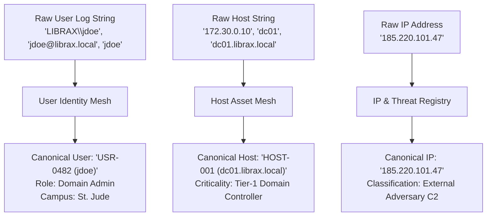

# Identity & Entity Resolution (`librax-entities`)

The `librax-entities` crate bridges the gap between raw identifier strings in logs and canonical, real-world assets and identities across the enterprise.

---

## Entity Hierarchy & Schema (`EntityRef`)

Entities in LibraX are categorized into strongly-typed variants:

```rust
pub enum EntityKind {
    Host,          // Physical server, virtual machine, or workstation
    User,          // Human principal, service account, or machine account
    Ip,            // Internal or external network IP address
    File,          // Executable, script, or document artifact
    Process,       // Running process instance with PID
    Hospital,      // Healthcare campus or operational facility
}

pub struct EntityRef {
    pub kind: EntityKind,
    pub id: String,         // Canonical unique identifier
    pub name: String,       // Human-readable display label
}
```

---

## Canonical Resolution Strategies



### 1. Host Asset Resolution
- **Multi-Identifier Aliasing:** Resolves NetBIOS names (`DC01`), FQDNs (`dc01.librax.local`), DHCP IP leases (`172.30.0.10`), and MAC addresses to a single persistent asset record.
- **Criticality Classification:**
  - **Tier-1 (Critical):** Domain Controllers, Root CAs, Key Management Services ($2.0\times$ risk multiplier).
  - **Tier-2 (High):** Electronic Health Record (EHR) databases, PACS diagnostic servers ($1.8\times$ risk multiplier).
  - **Tier-3 (Medium):** Nurse stations, administrative workstations, jumpboxes ($1.2\times$ risk multiplier).
  - **Tier-4 (Standard):** Standard user endpoints, guest networks ($1.0\times$).

### 2. User & Identity Mesh
- **Account Disambiguation:** Maps Kerberos Principal Names (`jdoe@LIBRAX.LOCAL`), Down-Level Logon names (`LIBRAX\jdoe`), and SAMAccountNames (`jdoe`) to a single person.
- **Privilege Tracking:** Maintains active directory group memberships (`Domain Admins`, `Enterprise Admins`, `Account Operators`, `HelpDesk`).
- **Activity Context:** Tracks standard working hours, standard login hosts, and standard campus locations to identify impossible travel and anomalous access.
