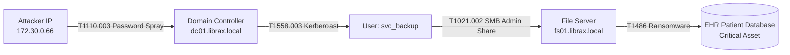

# Evidence Graph & Attack Path (`librax-graph` & `librax-correlation`)

The graph engine constructs a mathematical model of an ongoing cyber incident. Instead of presenting a linear list of disconnected alerts, LibraX represents the incident as an interconnected **Directed Acyclic Graph (DAG)** of entities, actions, and forensic evidence.

---

## Graph Data Model

The `IncidentGraph` is backed by `petgraph::graph::DiGraph`:

### Graph Node Schema
Nodes in the graph represent either an **Entity** or a **SecuritySignal**:
- **Entity Node:** Identity, Host, IP socket, File hash, or Database.
- **Signal Node:** Detection event with MITRE technique ID, timestamp, and severity.

### Graph Edge Types
Edges represent directional causal relationships between nodes:
- `ExecutedOn`: Process executed on target host.
- `AuthenticatedAs`: Network connection authenticated with specific user identity.
- `Targeted`: Signal or command targeted a destination host/service.
- `TraversedNetwork`: Traffic flowed across network sockets.
- `GeneratedSignal`: Raw telemetry event supported a detection rule.

---

## Temporal & Spatial Correlation Algorithm

The `Correlator` in `librax-correlation` clusters signals using multi-factor link scoring:

$$\text{LinkScore}(S_a, S_b) = \sum_{i \in \text{Factors}} w_i \cdot \text{MatchStrength}_i(S_a, S_b)$$

| Factor | Description | Weight ($w_i$) | Required Substantive? |
|---|---|---|---|
| **Identity ($F_{\text{id}}$)** | Signals share the same user account or principal | **0.40** | Yes |
| **Host ($F_{\text{host}}$)** | Signals occurred on the same physical/virtual host | **0.35** | Yes |
| **Network ($F_{\text{net}}$)** | Signals share source or destination IP/port | **0.30** | Yes |
| **Shared Evidence ($F_{\text{ev}}$)** | Signals cite overlapping raw event IDs | **0.40** | Yes |
| **ATT&CK Progression ($F_{\text{stage}}$)** | Signals represent sequential MITRE tactics | **0.25** | No (Co-factor only) |
| **Temporal ($F_{\text{time}}$)** | Signals occurred within sliding window (45 min) | **0.15** | No (Co-factor only) |

### The Substantive Link Rule
> **Golden Rule of LibraX Correlation:** Temporal proximity and stage ordering are true of any two alerts in a busy enterprise SOC. Therefore, a link is **only created** if at least one **substantive factor** (Identity, Host, Network, or Shared Evidence) is present.

---

## Blast Radius Calculation

The `librax-graph` module traverses the DAG from compromised nodes outward:
1. **Direct Blast Radius:** All hosts, identities, and databases directly touched by adversary commands.
2. **Reachable Blast Radius:** All hosts accessible via active Kerberos tickets, open firewall paths, and cached administrative credentials.
3. **Operational Impact Rating:** Computes total beds, clinical workstations, and patient databases at risk.
