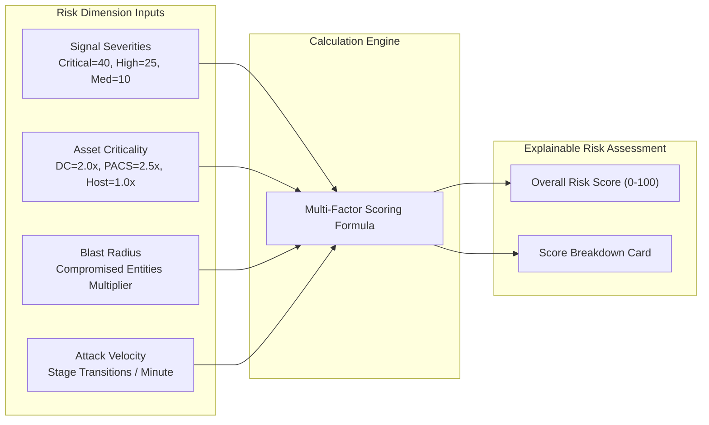

# Multi-Dimensional Risk Engine (`librax-risk`)

The `librax-risk` crate calculates explainable, multi-dimensional risk scores ($0–100$) for every incident. Rather than returning an opaque magic number, every score comes with a complete mathematical breakdown of its contributing inputs.

---

## Risk Mathematical Model

$$\text{OverallRisk} = \min\left(100.0, \, \left(\text{ThreatScore} \times \text{AssetCriticality} \times \text{BlastMultiplier}\right) + \text{VelocityBonus}\right)$$

---

## Risk Factors Breakdown

### 1. Threat Confidence & Signal Weights ($\text{ThreatScore}$)
Base severity is calculated from the set of distinct, non-duplicate detection signals:
- $\text{Critical Signal}$: **+40.0 pts**
- $\text{High Signal}$: **+25.0 pts**
- $\text{Medium Signal}$: **+10.0 pts**
- $\text{Low Signal}$: **+3.0 pts**

$$\text{ThreatScore} = 1.0 - \prod_{s \in \text{Signals}} (1.0 - \text{Weight}(s))$$

### 2. Asset Criticality Multiplier ($\text{AssetCriticality}$)
The maximum criticality among all entities involved in the incident graph:

| Asset Type | Criticality Tier | Multiplier | Clinical / Business Justification |
|---|---|---|---|
| **PACS / Diagnostic Imaging** | Tier-1 Mission Critical | **$2.5\times$** | Direct impact on patient diagnosis and surgical scheduling |
| **Domain Controller (DC)** | Tier-1 Enterprise Core | **$2.0\times$** | Total administrative compromise of all domain credentials |
| **EHR Patient Database** | Tier-2 High Impact | **$1.8\times$** | Risk of massive patient record exfiltration and HIPAA breach |
| **Nurse Station / Clinical Host** | Tier-3 Medium Impact | **$1.3\times$** | Local hospital ward disruption |
| **Standard User Workstation** | Tier-4 Standard Endpoint | **$1.0\times$** | Contained single-user endpoint compromise |

### 3. Blast Radius Multiplier ($\text{BlastMultiplier}$)
Scales based on the count of confirmed compromised entities ($N_{\text{entities}}$):
$$\text{BlastMultiplier} = 1.0 + \left(0.15 \times \min(N_{\text{entities}}, 6)\right)$$

### 4. Attack Velocity Bonus ($\text{VelocityBonus}$)
If an adversary progresses through 3 or more MITRE tactics within 10 minutes, an acceleration penalty of **+10.0 pts** is added to reflect an active, rapid intrusion.

---

## Risk Score Tones in UI

- **Critical ($80–100$):** Immediate containment required. Active domain takeover or ransomware staging.
- **High ($60–79$):** Confirmed credential access and lateral movement.
- **Medium ($40–59$):** Reconnaissance, password spraying, or anomalous privilege usage.
- **Low ($1–39$):** Isolated suspicious activity or single-endpoint alert.
