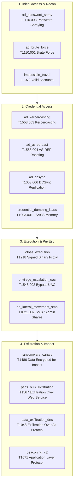

# Detection Engine & MITRE ATT&CK (`librax-detection`)

The `librax-detection` crate is the analytical core that inspects normalized events, matches malicious patterns, and produces structured `SecuritySignal` alerts aligned with the MITRE ATT&CK framework.

---

## The `Detector` Trait

Every rule implements the unified `Detector` trait:

```rust
pub trait Detector: Send + Sync {
    /// Unique identifier for this rule (e.g., "ad_kerberoasting").
    fn id(&self) -> &'static str;

    /// Human-readable title for generated signals.
    fn name(&self) -> &'static str;

    /// Primary MITRE ATT&CK technique (e.g., "T1558.003").
    fn technique(&self) -> &'static str;

    /// MITRE ATT&CK tactic category (e.g., "Credential Access").
    fn tactic(&self) -> &'static str;

    /// Default baseline severity (Low, Medium, High, Critical).
    fn severity(&self) -> Severity;

    /// Evaluate an incoming event. Returns zero or more SecuritySignals.
    fn evaluate(&mut self, event: &NormalizedEvent) -> Vec<SecuritySignal>;

    /// Clear stateful in-memory tracking windows.
    fn reset(&mut self);
}
```

---

## Detection Mesh Overview

LibraX organizes its detection library across standard MITRE ATT&CK tactical stages:



---

## Stateless vs. Stateful Detection Algorithms

### 1. Stateless Detections (Single-Event Signatures)
Stateless rules analyze an individual `NormalizedEvent` in isolation. They have $O(1)$ complexity and zero memory overhead.

- **Example: `credential_dumping_lsass`**
  - **Condition:** Process telemetry indicates `rundll32.exe comsvcs.dll, MiniDump` targeting `lsass.exe`, or non-system process requesting `PROCESS_VM_READ` against `lsass.exe`.
  - **Output:** Emits Critical `SecuritySignal` citing event ID and process lineage.

### 2. Stateful Detections (Sliding Window Trackers)
Stateful rules track historical event sequences across temporal windows using in-memory ring buffers or hash maps.

- **Example: `ad_password_spray` (`T1110.003`)**
  - **Algorithm:**
    ```
    Window: 180 seconds (3 minutes)
    Threshold: Failed logins against >= 5 distinct usernames from a single source IP
    Data Structure: HashMap<IpAddr, BTreeMap<Username, Vec<Timestamp>>>
    ```
  - **Pruning:** Evicts timestamp entries older than window duration.
  - **Trigger:** When distinct failed accounts from $IP$ exceed threshold, generates High severity signal citing all failed authentication event IDs.

---

## Security Signal Output Structure

```rust
pub struct SecuritySignal {
    pub signal_id: String,
    pub detector_id: String,
    pub title: String,
    pub severity: Severity,
    pub tactic: String,
    pub technique: String,
    pub timestamp: DateTime<Utc>,
    pub host: Option<String>,
    pub user: Option<String>,
    pub src_ip: Option<IpAddr>,
    pub dst_ip: Option<IpAddr>,
    pub evidence: Vec<String>,     // Cited Event IDs
    pub metadata: HashMap<String, String>,
}
```
