# MITRE ATT&CK Mapping & Matrix (`librax-mitre`)

LibraX natively integrates the **MITRE ATT&CK Enterprise Matrix (v18.1)**. Every detection rule, correlation link, incident briefing, and adversary playback scenario maps directly to specific MITRE tactics and technique IDs.

---

## MITRE ATT&CK Enterprise Matrix Mapping

```mermaid
graph LR
    subgraph TA0001["1. Initial Access"]
        T1566_001["T1566.001 Spearphishing"]
        T1078["T1078 Valid Accounts"]
    end

    subgraph TA0002["2. Execution"]
        T1204_002["T1204.002 Malicious File"]
        T1059_001["T1059.001 PowerShell"]
    end

    subgraph TA0005["3. Defense Evasion"]
        T1027["T1027 Obfuscated Payloads"]
    end

    subgraph TA0006["4. Credential Access"]
        T1110_003["T1110.003 Password Spraying"]
        T1110_001["T1110.001 Password Guessing"]
        T1558_003["T1558.003 Kerberoasting"]
        T1558_004["T1558.004 AS-REP Roasting"]
        T1003_006["T1003.006 DCSync Secrets Dump"]
    end

    subgraph TA0007["5. Discovery"]
        T1046["T1046 Network Service Scan"]
        T1018["T1018 Remote Host Discovery"]
        T1087_002["T1087.002 Domain Account Enum"]
        T1135["T1135 Network Share Enum"]
    end

    subgraph TA0008["6. Lateral Movement"]
        T1021_002["T1021.002 SMB Admin Shares"]
        T1021_006["T1021.006 WinRM Remote Mgmt"]
        T1021["T1021 Remote Services"]
    end

    subgraph TA0009["7. Collection & Staging"]
        T1213["T1213 Data Repositories"]
        T1005["T1005 Data From Host"]
        T1074_001["T1074.001 Local Staging"]
        T1560_001["T1560.001 Archive (7-Zip)"]
    end

    subgraph TA0011["8. Command & Control"]
        T1071_001["T1071.001 Web Protocols (C2)"]
    end

    subgraph TA0040["9. Impact"]
        T1486["T1486 Data Encryption (Ransomware)"]
        T1490["T1490 Inhibit Recovery (VSS Delete)"]
        T1498["T1498 Network Denial of Service"]
    end

    TA0001 --> TA0002
    TA0002 --> TA0005
    TA0005 --> TA0006
    TA0006 --> TA0007
    TA0007 --> TA0008
    TA0008 --> TA0009
    TA0009 --> TA0011
    TA0011 --> TA0040
```



---

## Comprehensive Technique Catalog

| Technique ID | Technique Name | MITRE Tactic | Detector Rule in LibraX | Triggering Telemetry & Evidence |
|---|---|---|---|---|
| **`T1566.001`** | Spearphishing Attachment | Initial Access | `phishing_attachment_malware` | Email gateway logs attachment hash matching malicious threat feed |
| **`T1204.002`** | User Execution: Malicious File | Execution | `user_execution_macro` | Word/Excel process spawning `powershell.exe` or `cmd.exe` |
| **`T1078`** | Valid Accounts | Initial Access / Persistence | `impossible_travel`, `anomalous_login` | VPN/IdP authentication from unusual geolocation or dormant account |
| **`T1059.001`** | Command and Scripting: PowerShell | Execution | `lolbas_powershell_encoded` | EDR detects Base64-encoded command line (`-enc`, `-w hidden`) |
| **`T1027`** | Obfuscated Files or Information | Defense Evasion | `payload_obfuscation_detected` | High-entropy process command lines or obfuscated script blocks |
| **`T1110.003`** | Password Spraying | Credential Access | `ad_password_spray` | $>5$ distinct failed logins (`0xC000006A`) within 3 minutes from single IP |
| **`T1110.001`** | Password Guessing / Brute Force | Credential Access | `ad_brute_force` | Rapid repeated failed authentications targeting a single user account |
| **`T1558.003`** | Kerberoasting | Credential Access | `ad_kerberoasting` | Rapid requests for Kerberos TGS tickets with RC4 encryption (`0x17`) for service SPNs |
| **`T1558.004`** | AS-REP Roasting | Credential Access | `ad_asreproast` | Kerberos AS-REQ ticket request for accounts with `DONT_REQ_PREAUTH` enabled |
| **`T1003.006`** | DCSync Directory Replication | Credential Access | `ad_dcsync` | DRSUAPI `DsGetNCChanges` RPC call originating from a non-DC host |
| **`T1087.002`** | Domain Account Discovery | Discovery | `ad_recon_ldap_query` | LDAP search queries enumerating high-privilege groups (`Domain Admins`) |
| **`T1135`** | Network Share Discovery | Discovery | `ad_recon_share_enum` | High-frequency RPC/SMB enumeration of available network shares |
| **`T1046`** | Network Service Discovery | Discovery | `network_port_scan` | Firewall/EDR detects TCP SYN scan across subnet |
| **`T1018`** | Remote System Discovery | Discovery | `host_discovery_ping_sweep` | Rapid ICMP/NetBIOS sweeps across internal IP segments |
| **`T1021.002`** | SMB / Windows Admin Shares | Lateral Movement | `ad_lateral_movement_smb` | Authenticated connects to administrative shares (`ADMIN$`, `C$`, `IPC$`) |
| **`T1021.006`** | Windows Remote Management (WinRM) | Lateral Movement | `lateral_movement_winrm` | EDR detects `wsmprovhost.exe` spawning child processes over port 5985/5986 |
| **`T1213`** | Data from Information Repositories | Collection | `pacs_bulk_query`, `ehr_dump` | High-volume DICOM `C-FIND` queries or SQL database `SELECT *` dumps |
| **`T1005`** | Data from Local System | Collection | `local_staging_search` | Automated file discovery scripts searching for `.docx`, `.pdf`, `.kdbx` |
| **`T1074.001`** | Local Staging | Collection | `staging_directory_archive` | Large files consolidated into `C:\Windows\Temp` or `C:\Users\Public` |
| **`T1560.001`** | Archive via Utility (7-Zip) | Collection | `compression_utility_7zip` | Invocation of `7z.exe` or `rar.exe` with password protection flags (`-p`) |
| **`T1071.001`** | Web Protocols: C2 Beaconing | Command and Control | `beaconing_c2_http` | Regular interval outbound HTTPS connections to low-reputation domain |
| **`T1490`** | Inhibit System Recovery | Impact | `vssadmin_shadow_delete` | Execution of `vssadmin.exe delete shadows /all /quiet` or `wbadmin` |
| **`T1486`** | Data Encrypted for Impact | Impact | `ransomware_canary_trip` | Rapid file modifications, extension renaming, and canary file modification |
| **`T1498`** | Network Denial of Service | Impact | `dos_syn_flood` | Volumetric packet floods overwhelming hospital network links |

---

## Tactic Progression Scoring in `librax-correlation`

LibraX models attack campaigns as forward-progressing state machines:

```
Recon / Initial Access ──► Credential Access ──► Lateral Movement ──► Collection ──► Impact
```

When two signals share a substantive entity (e.g. host or identity) and represent **sequential tactical progression** (e.g. `Credential Access` followed by `Lateral Movement`), the correlation engine awards a **+0.25 progression bonus** ($w_{\text{stage}}$). This boosts the confidence of multi-stage attack detection while suppressing uncoordinated noise.
