```mermaid
graph LR
    subgraph Ingestion["1. Telemetry Ingestion"]
        AD["Active Directory"]
        EDR["EDR / Sysmon"]
        FW["Firewalls / Network"]
        PAM["PAM / Identity"]
        PACS["Medical PACS"]
    end

    subgraph CoreEngine["2. LibraX Core Pipeline (Rust)"]
        NORM["librax-normalizer<br/>Raw -> Canonical"]
        DET["librax-detection<br/>Rules & MITRE ATT&CK"]
        GRAPH["librax-graph & entities<br/>Entity Graph & Mesh"]
        CORR["librax-correlation<br/>Sliding Temporal Windows"]
        RISK["librax-risk<br/>Asset & Impact Multipliers"]
        AI["librax-ai & incidents<br/>Provenance Briefings"]
    end

    subgraph Output["3. Autonomous Operations"]
        API["Axum API :8080"]
        UI["React SOC UI :3000"]
        RESP["librax-response<br/>Simulation & Approval"]
    end

    Ingestion --> NORM
    NORM --> DET
    DET --> GRAPH
    GRAPH --> CORR
    CORR --> RISK
    RISK --> AI
    AI --> API
    API --> UI
    UI --> RESP
```

# LibraX — Autonomous SOC & Security Correlation Platform

**LibraX** is an evidence-driven, high-throughput security correlation and autonomous response platform designed for critical infrastructure and enterprise environments. It ingests high-volume disparate telemetry, normalizes events across multi-vendor formats, evaluates stateful and stateless threat detectors, constructs an evidence graph across identities and hosts, aggregates signals into contextual incidents, scores multi-dimensional risk, and provides automated, transparent incident briefings and safe containment playbooks.

---

---

## Core Engineering Principles

### 1. Zero Hallucination & Provable Evidence
Every claim in a LibraX incident briefing cites the exact raw event identifiers that establish it. Claims are strictly categorized into **Facts** (supported by cited log evidence), **Inferences** (logical deductions based on attack progression), and **Key Unknowns** (missing telemetry due to blind spots or stealth).

### 2. Context-Driven Correlation Over Time-Proximity
Proximity in time is **never** sufficient on its own to merge alerts. Unrelated alerts occurring within the same second remain isolated unless linked by substantive context: shared identity, target host, network address socket, process hash, or causal ATT&CK progression.

### 3. Transparent, Multi-Dimensional Risk
Risk scores (0–100) are never arbitrary single numbers. They are calculated dynamically by separating:
- **Threat Confidence:** Rigor and count of independent detection signals.
- **Asset Criticality:** Tier-1 Domain Controllers, EHR databases, and PACS diagnostic imaging machines.
- **Blast Radius:** Count of reachable enterprise assets and patient-impact multipliers.

### 4. Non-Destructive Response Simulation
Autonomous response playbooks (endpoint isolation, credential revocation, firewall IP blocking) execute in **simulation mode** by default, modeling containment efficacy and blast radius before requiring Tier-2 named human approval for high-impact actions.

---

## Technology Stack

| Layer | Technologies & Frameworks | Description |
|---|---|---|
| **Core Engine** | **Rust (2024 Edition, 1.85+)** | 17-member workspace using `Axum 0.8`, `Tokio`, `Petgraph`, `DashMap`, `Chrono`, `Serde` |
| **Frontend UI** | **TypeScript 5.7, React 18, Vite 6** | High-density SOC console with interactive SVG Attack Graph, live telemetry stream, and response controls |
| **Log Ingest** | **Python 3.10+, Requests, Regex** | Zero-latency Samba JSON audit log shipper with DRSUAPI/Kerberos parsing |
| **Attack Lab** | **Docker & Docker Compose** | Isolated `172.30.0.0/24` subnet hosting Samba 4 AD DC, Impacket adversary runner, and log shippers |
| **Offensive Tools** | **Impacket, Smbclient, Kerberos** | Real password spraying, Kerberoasting, AS-REP roasting, DCSync, and SMB lateral movement |
| **Documentation** | **Python MkDocs & Material Theme** | Full searchable architectural documentation with interactive Mermaid diagrams |

---

## Navigation & Deep Dives

- [**System Architecture & Pipeline**](architecture/overview.md) — High-level architecture, event flow lifecycle, and data models.
- [**Rust Workspace & Crates**](architecture/crates.md) — Exhaustive review of all 17 crates and services in the workspace.
- [**Log Normalizer & Parsers**](ingestion/normalizer.md) — How raw logs are normalized into canonical schema.
- [**Detection Mesh & ATT&CK**](detection/detectors.md) — Stateful and stateless detection algorithms.
- [**Evidence Graph & Correlation**](correlation/graph.md) — Graph algorithms, temporal clustering, and blast radius calculation.
- [**AI Briefing Synthesis**](ai/briefings.md) — Deterministic, citation-backed natural language briefing generation.
- [**Docker Lab & Active Directory**](lab/docker-architecture.md) — Live lab topology, Samba DC configuration, and adversary playbooks.
- [**Getting Started & Runbook**](guides/getting-started.md) — Setup, local build, test suite execution, and verification.
