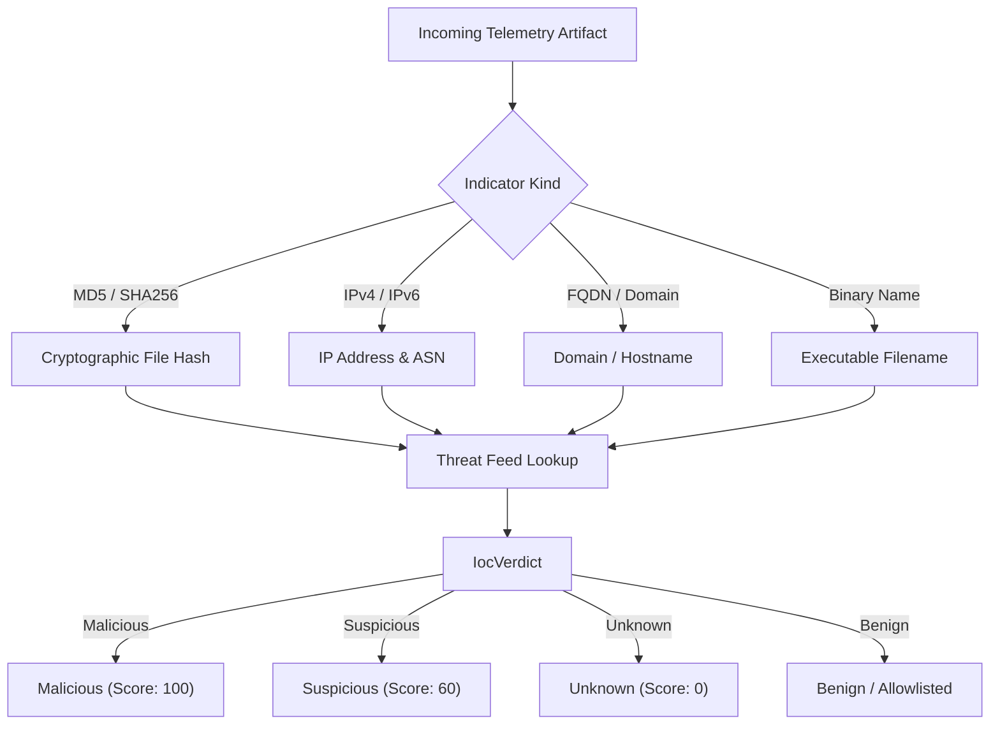

# Threat Intelligence & Enrichment (`librax-enrichment`)

The `librax-enrichment` crate augments incoming telemetry with contextual metadata, reputation scores, and threat intelligence before detection evaluation.

---

## Indicators of Compromise (IOC) Engine

LibraX maintains an in-memory threat intelligence database indexing millions of known malicious artifacts across four primary indicator types:



### Indicator Record Schema (`IocRecord`)

```rust
pub struct IocRecord {
    pub kind: IocKind,                 // Md5, Sha256, Ipv4, Domain, File
    pub value: String,                 // Indicator value (e.g. "185.220.101.47")
    pub verdict: IocVerdict,           // Malicious, Suspicious, Unknown, Benign
    pub threat_name: Option<String>,   // e.g. "CobaltStrike C2", "LockBit Ransomware"
    pub malware_family: Option<String>,// e.g. "Mimikatz", "Conti", "Qakbot"
    pub detection_ratio: Option<String>, // e.g. "58/72" AV vendor hits
    pub signed: Option<bool>,          // Binary digital signature validity
    pub signer: Option<String>,        // Recognized code signing entity
    pub categories: Vec<String>,       // MITRE ATT&CK tactic tags
    pub feeds: Vec<String>,            // Feed sources (e.g. "AbuseIPDB", "AlienVault")
    pub notes: Vec<String>,            // Threat intelligence context
}
```

---

## Enrichment Pipeline

When a `NormalizedEvent` passes through enrichment:

1. **GeoIP & Autonomous System Number (ASN):**
   - External IPs are resolved to country codes (e.g. `RO`, `RU`, `CN`, `US`), ASN IDs (e.g. `AS9009 M247 Europe`), and network classifications (Residential, Datacenter, Tor Exit Node, Bulletproof Hoster).
2. **File Reputation & Multi-Engine AV Scoring:**
   - Hashes (`sha256`, `md5`) are queried against the local threat cache.
   - Known legitimate administrative tools (e.g. validly signed Microsoft binaries) are tagged to suppress false positives.
3. **Internal Sighting Cross-Reference:**
   - Every queried indicator records internal sightings across retained telemetry, allowing instant pivoting from a global threat indicator to all internal endpoints that interacted with it.
