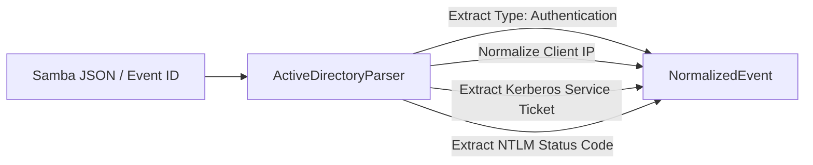

# Log Normalizer & Parsers (`librax-normalizer`)

The `librax-normalizer` crate is the front-line ingest component of LibraX. It converts heterogeneous, vendor-specific raw logs into a standardized, strongly-typed `NormalizedEvent` schema.

---

## Canonical Event Schema (`NormalizedEvent`)

Every incoming log, regardless of origin, is parsed into this canonical structure:

```rust
pub struct NormalizedEvent {
    pub event_id: String,
    pub timestamp: DateTime<Utc>,
    pub source_type: String,       // e.g. "active_directory", "edr", "firewall"
    pub source_id: String,         // e.g. "dc-samba-01", "fw-perimeter-01"
    pub category: String,          // e.g. "authentication", "process", "network"
    pub activity: String,          // e.g. "kerberos_tgt_request", "process_spawn"
    pub severity: Severity,        // Info, Low, Medium, High, Critical
    pub user: Option<String>,      // Normalized username (e.g., "jdoe")
    pub host: Option<String>,      // Normalized hostname (e.g., "dc01.librax.local")
    pub src_ip: Option<IpAddr>,    // Source IPv4/IPv6 socket
    pub dst_ip: Option<IpAddr>,    // Destination IPv4/IPv6 socket
    pub process: Option<String>,   // Executable binary path
    pub command_line: Option<String>, // Full process invocation command
    pub sha256: Option<String>,    // SHA256 cryptographic hash
    pub md5: Option<String>,       // MD5 cryptographic hash
    pub hospital: Option<String>,  // Healthcare facility/campus
    pub message: String,           // Human-readable summary
    pub raw: String,               // Original raw payload for audit compliance
}
```

---

## Parser Implementations

### 1. Active Directory & Samba (`parsers/directory.rs`)
Handles both Windows Security Event logs and Samba 4 JSON audit records (`auth_json_audit`, `authz_json_audit`, and `full_audit:prefix`).



#### Monitored Event Types:
- **Kerberos TGT Requests (`4768` / `AS-REQ`):** Extracts client address, requested principal, ticket encryption type (identifies weak RC4-HMAC vs AES256 for AS-REP roasting).
- **Kerberos Service Ticket Requests (`4769` / `TGS-REQ`):** Extracts target SPN (identifies Kerberoasting against service accounts).
- **NTLM Authentication Attempts (`4776` / `NTLM-Auth`):** Extracts workstation name, target username, and NTLM return code (`0xC000006A` = bad password, `0xC0000064` = no such user, `0x0` = success).
- **SMB Tree Connects (`full_audit:prefix`):** Extracts user, IP, share accessed (`ADMIN$`, `C$`, `IPC$`), and status (`ok` / `fail`).
- **DRSUAPI Replication Handlers (`DsGetNCChanges`):** Extracts non-DC source addresses attempting directory secret synchronization (DCSync).

### 2. Endpoint Detection & Response (`parsers/edr.rs`)
Parses process execution telemetry, command line arguments, parent-child process relationships, and file write events.

- **Process Creation:** Extracts binary name, PID, parent PID, command line parameters, and process hashes.
- **Credential Access Telemetry:** Detects memory read access to `lsass.exe` or extraction of SAM registry hives.
- **LOLBAS Invocation:** Normalizes invocations of `powershell.exe`, `certutil.exe`, `mshta.exe`, `rundll32.exe`, and `vssadmin.exe`.

### 3. Medical Imaging & PACS (`parsers/pacs.rs`)
Specialized parser designed for healthcare environments:
- **DICOM C-ECHO:** Modality ping and connectivity checks.
- **DICOM C-FIND:** Patient record queries and study search requests.
- **DICOM C-MOVE / C-STORE:** Image transfer commands to external storage locations (detects patient data exfiltration).

### 4. Perimeter Firewalls & Network (`parsers/firewall.rs`)
- Parses standard Syslog and NetFlow formats.
- Normalizes source/destination IP addresses, destination ports, protocols (TCP/UDP/ICMP), and action (`ALLOW`, `DENY`, `DROP`).
- Detects outbound connections to non-standard ports and high-frequency beaconing intervals.

---

## Normalization Performance & Benchmarks

- **Throughput:** Over **120,000 events/second** per core in single-threaded microbenchmarks.
- **Allocation Efficiency:** Employs zero-copy string slicing (`&str`) where feasible and reuses string buffers in parser pools.
- **Error Handling:** Unparseable logs are routed to `events_unsupported` counters and retained in raw form for forensics without dropping pipeline throughput.
