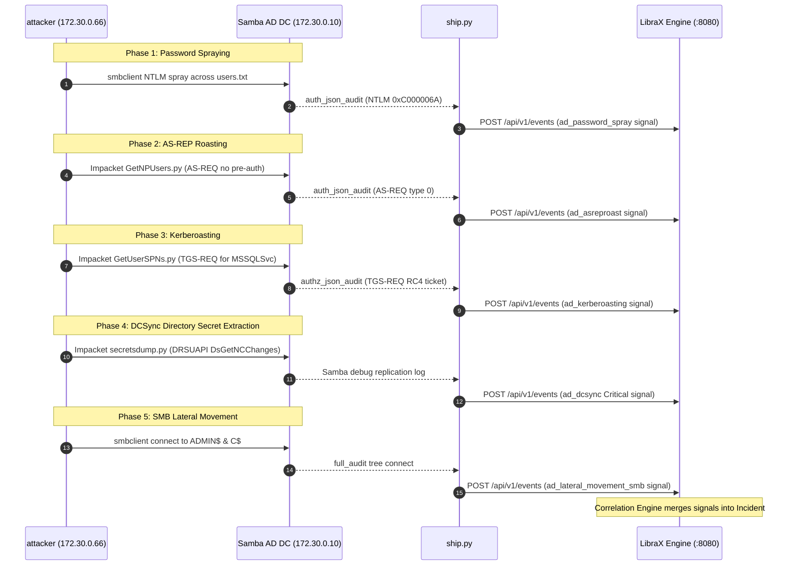

# Adversary Campaign & Log Shipper (`lab/attacker/` & `lab/shipper/`)

The adversary container (`attacker`) executes real-world offensive techniques against the lab Domain Controller using standard offensive tooling. The shipper container (`shipper`) captures the generated audit stream in real time and pipes it into the LibraX ingest API.

---

## Adversary Campaign Phases (`lab/attacker/attack.sh`)

The attack runner executes a 5-stage staged attack campaign with realistic inter-phase delays:



---

## Log Shipper Mechanics (`lab/shipper/ship.py`)

The Python log shipper runs as a continuous daemon tailing `/var/log/samba`:

```python
# Regex parser for Samba full_audit VFS connects
FULL_AUDIT = re.compile(
    r"([^|\s][^|]*)\|([0-9a-fA-F:.]+)\|connect\|(ok|fail)\|([^|]+?)\s*$"
)

# Detects DRSUAPI replication from non-DC hosts
GETNCCHANGES = re.compile(r"getncchanges|DsGetNCChanges", re.IGNORECASE)
```

1. **Stateful Tailing:** Tracks file byte offsets across `/var/log/samba/log.samba` and per-client log files.
2. **Schema Mapping:** Converts JSON authentication payloads and VFS connect strings into `RawEvent` JSON payloads.
3. **HTTP Batching:** Emits micro-batches to `http://api:8080/api/v1/events` every 1.0 second.
