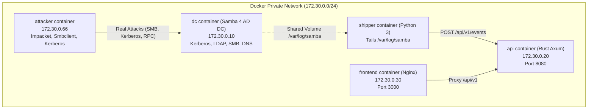

# Docker Lab & Active Directory Architecture (`lab/`)

LibraX includes a self-contained, real-world Active Directory attack lab in `lab/` that stands up a genuine Samba 4 Domain Controller, streams real audit logs into LibraX, and executes automated multi-phase offensive campaigns.

---

## Lab Network Topology

All lab containers execute on a private Docker bridge network (`labnet: 172.30.0.0/24`):

---

## Container Breakdown

| Service | Image Base | Role & Purpose | Key Ports / Volumes |
|---|---|---|---|
| `dc` | Ubuntu / Samba 4 | Real Active Directory Domain Controller (`LIBRAX.LOCAL`) with LDAP, Kerberos, DNS, and SMB audit logging | `53`, `88`, `389`, `445`, `636` Volume: `/var/log/samba` |
| `attacker` | Debian / Python | Offensive attack runner executing staged intrusion campaigns | `attack.sh`, Impacket suite, `smbclient` |
| `shipper` | Python 3 Alpine | Zero-latency audit log shipper tailing Samba JSON logs and forwarding to LibraX ingest API | `ship.py` Mounts `/var/log/samba` |
| `api` | Rust / Alpine (Multi-stage) | LibraX core correlation engine and Axum API | `8080:8080` |
| `frontend` | Node / Nginx Alpine | React 18 SOC analyst workstation interface | `3000:80` |

---

## Samba AD Audit Configuration (`lab/dc/entrypoint.sh`)

Samba is configured with enterprise audit logging modules:
- `auth_json_audit`: Emits one structured JSON log line per Kerberos/NTLM authentication attempt.
- `authz_json_audit`: Emits structured JSON logs for service authorization and access control checks.
- `vfs objects = full_audit`: Audits file share tree connects (`ADMIN$`, `C$`, `IPC$`) formatted as `%u|%I|connect|%T|%S`.
- `log level = 3 auth_json_audit:3 authz_json_audit:3 dsdb_json_audit:3`: Enables high-fidelity directory service auditing.
