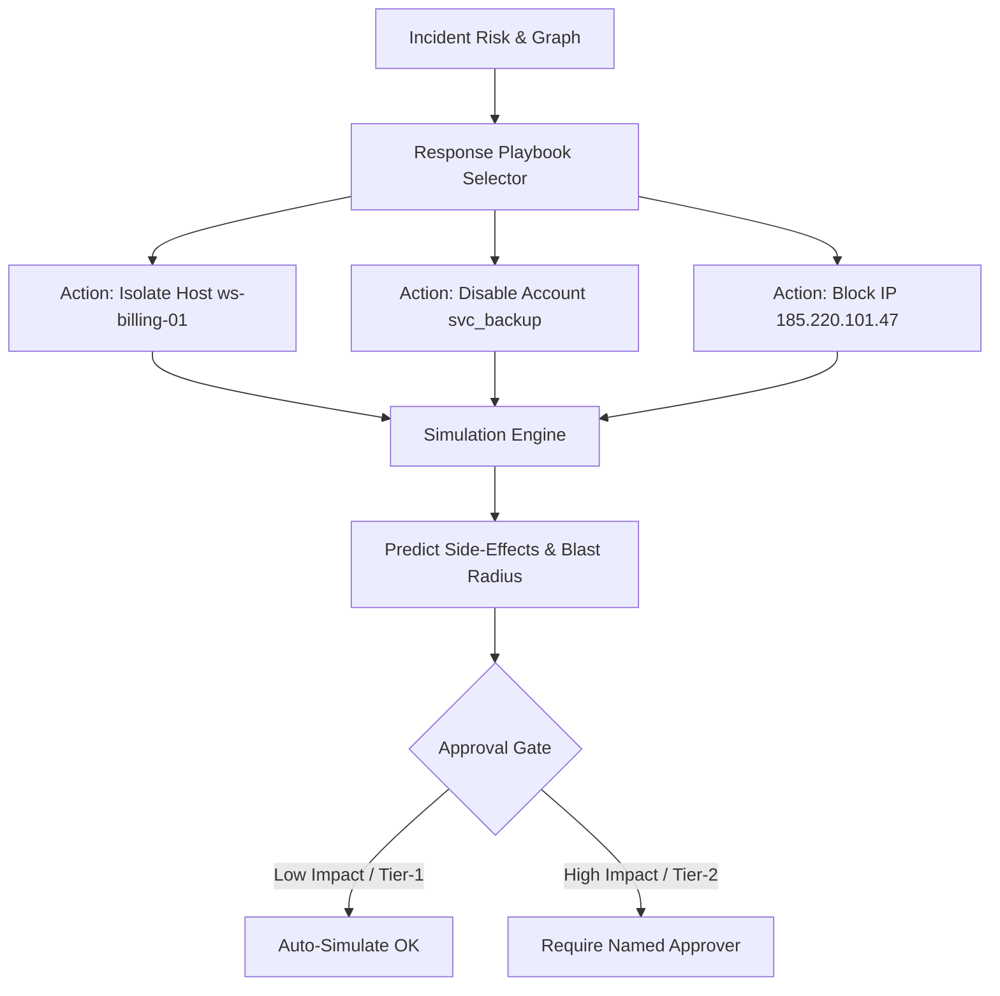

# Response Engine & Simulation (`librax-response`)

The `librax-response` crate generates, evaluates, and safely simulates automated containment actions to neutralize active threats while safeguarding healthcare business operations.

---

## Safety-First Philosophy

In critical environments like hospitals and industrial control systems, an automated response that isolates a life-saving medical device or shuts down an emergency room database is more dangerous than the malware itself.

LibraX addresses this with three safety gates:
1. **Simulation by Default:** All containment actions run in non-destructive simulation mode first.
2. **Blast Radius Impact Analysis:** Predicts the operational consequences of containment (e.g. "Isolating `pacs01` will disconnect 14 clinical workstations and stop MRI transfers").
3. **Named Human Approval Gate:** High-impact destructive actions require explicit approval with an analyst identifier.

---

## Containment Action Types

```rust
pub enum ResponseActionKind {
    IsolateHost,            // Cut network connectivity via EDR / switch port
    DisableAccount,         // Lock Active Directory user account
    RevokeKerberosTickets,  // Invalidate Kerberos TGT and TGS tickets
    BlockIpAtFirewall,      // Add edge firewall rule dropping external IP
    KillProcessTree,        // Terminate suspicious process lineage
    QuarantineFile,         // Move binary artifact to secure vault
}
```



---

## Action Execution Lifecycle

```rust
pub struct ResponseAction {
    pub action_id: String,
    pub kind: String,                      // "isolate_host", "disable_account", etc.
    pub target: EntityRef,                 // Target entity to be contained
    pub incident_id: String,
    pub confidence: f32,                   // Confidence that action is necessary
    pub rationale: String,                 // Why this action was recommended
    pub requires_approval: boolean,        // Whether human Tier-2 signature is needed
    pub status: ResponseStatus,            // Recommended, AwaitingApproval, Simulated, Declined
    pub simulated_at: Option<DateTime<Utc>>,
    pub result: Option<String>,            // Simulation output or execution report
}
```

### Simulation Output Example
```json
{
  "action_id": "ACT-8841",
  "kind": "disable_account",
  "target": { "kind": "user", "id": "USR-092", "name": "svc_backup" },
  "status": "simulated",
  "simulated_at": "2026-09-14T14:48:12Z",
  "result": "[SIMULATED] Would execute Active Directory lockout for principal 'svc_backup@LIBRAX.LOCAL' across all 2 Domain Controllers. Active Kerberos TGTs (3) would be invalidated. 0 clinical services depend on this account."
}
```
